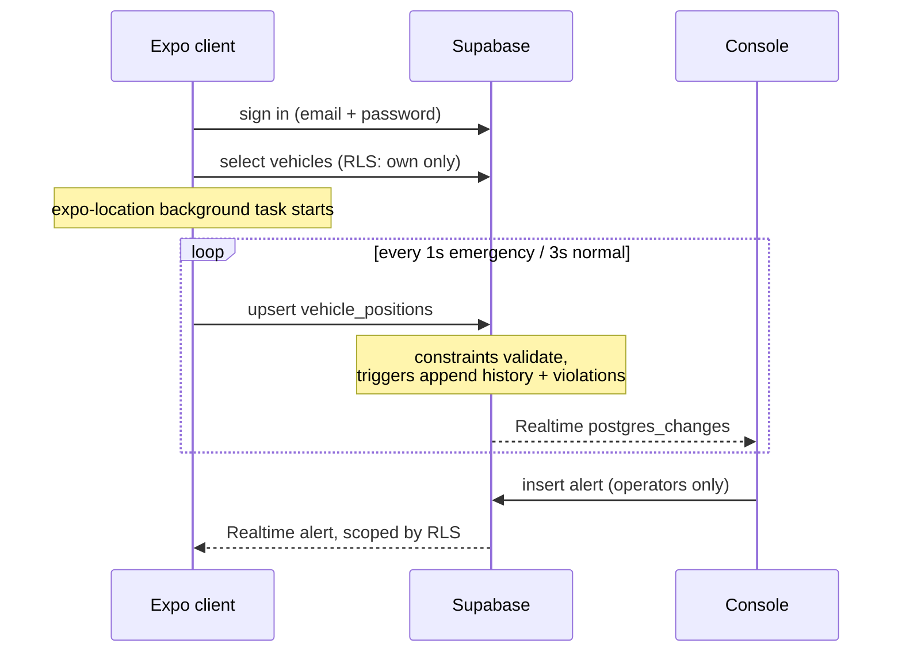

# SUTRA — Real-Time Vehicle Telemetry

A driver's phone streams live GPS to Supabase. An operator watches the fleet on
a map, sends alerts, and reviews where and when rules were broken.

| Component | What it is | Status |
| --- | --- | --- |
| `mobile/` | Expo (React Native) vehicle client | current |
| `admin-dashboard/` | Operator + driver console, vanilla JS | current |
| `supabase/` | Postgres schema, RLS, Edge Functions, tests | current |
| `backend-mock/` | Original Node WebSocket relay | superseded |
| `apk/` | Original Kotlin/Compose client | superseded |

**Live**

- Dashboard — https://sutra-control--l1iydflj3v.expo.app
- Supabase project — `ytqpjxpzhgintwpbujcy`
- Android APK — built via EAS, see *Setup*

---

## How it works



One account works in both the app and the dashboard. Role is decided by data,
not by a separate login.

---

## Roles

| | Operator | Driver |
| --- | --- | --- |
| Fleet map and list | every vehicle | own vehicles |
| Drive history and violations | every vehicle | own vehicles |
| Send alerts | yes | no |
| Emergency corridor broadcast | — | only if authorized |

An operator is a row in `operators`. Nobody can self-promote: the table has no
insert policy. Access is granted by adding an address to `operator_invites`,
which a trigger honours on signup.

The console is deliberately **one interface for both roles**. Scope is enforced
by row-level security rather than by hiding things in the browser, so an
operator's list contains every vehicle because the database returns every
vehicle.

---

## Security model

Emergency privilege is a database column an administrator sets. It is **not**
something a driver can claim.

- `vehicles.is_emergency_authorized` is protected by a `BEFORE UPDATE` trigger,
  because Postgres has no column-level RLS on `UPDATE`. A driver attempting to
  set it gets `P0001`. An administrator still can: the check is on
  `current_user`, not on the `role` setting, which would have made the privilege
  ungrantable.
- `vehicle_positions` has **no emergency column at all**. Status is derived by
  joining to `vehicles`, so a modified client has nothing to forge.
- Range checks on latitude, longitude, speed and heading are database
  constraints, not application code.
- History and violations are written by triggers, so they cannot be skipped by a
  modified client.
- Alerts are readable only by their addressee or as a broadcast. Only operators
  can send, and only under their own identity.

Authorize a vehicle:

```sql
update public.vehicles
   set is_emergency_authorized = true
 where vehicle_number = 'KA-03-AB-1234';
```

Grant operator access:

```sql
insert into public.operator_invites (email, note)
values ('ops@example.com', 'Control room');

select public.sync_operator_invites();  -- if the account already exists
```

---

## Data model

| Table | Purpose |
| --- | --- |
| `vehicles` | One row per vehicle, owned by a driver |
| `vehicle_positions` | Live position, one upserted row per vehicle |
| `position_history` | Append-only track, written by trigger |
| `violations` | Speeding episodes with where, when and peak speed |
| `alerts`, `alert_receipts` | Operator messages and acknowledgements |
| `operators`, `operator_invites` | Who may watch the whole fleet |
| `settings` | Speed limit, shared by trigger and clients |
| `retention_policy` | Prune windows, as data rather than code |

Violations are recorded as **episodes**, not per frame: one row per period above
the limit, keeping the worst speed, closed on dropping 5 km/h under it so
hovering at the limit does not churn.

Retention runs nightly via `pg_cron`. Open violations are exempt, since an old
row for a vehicle speeding right now is not stale data.

---

## No API keys for maps

| Layer | Provider | Key required |
| --- | --- | --- |
| Map rendering | MapLibre GL | none |
| Tiles | OpenFreeMap (OpenStreetMap data) | none |
| Routing | OSRM | none |
| Geocoding | Nominatim | none |

Routing and geocoding go through Edge Functions rather than being called
directly, so a provider can be swapped by redeploying a function instead of
shipping a new app. The public OSRM and Nominatim endpoints are free but
intended for light use; point `ROUTER_URL` and `GEOCODER_URL` at your own
instances before depending on them.

---

## Setup

### 1. Configuration

```bash
cp mobile/.env.example               mobile/.env
cp admin-dashboard/config.example.js admin-dashboard/config.js
```

Both need only a Supabase URL and anon key. The anon key is publishable by
design and constrained by RLS; a `service_role` key must never appear in either.

The mobile app also carries these in `app.config.ts` `extra`, so a build cannot
ship without them. Environment variables still take precedence when set.

### 2. Database

```bash
npx supabase link --project-ref <ref>
npx supabase db push
npx supabase functions deploy directions
npx supabase functions deploy geocode
```

### 3. Dashboard

```bash
cd admin-dashboard && python -m http.server 8080
```

Deploy with `cd mobile && npx eas deploy --export-dir dashboard-dist`.

### 4. Android app

```bash
cd mobile
npm install
npm run build:apk        # EAS cloud build, all four ABIs
```

EAS is the recommended path. A local build works but needs the Android SDK and
enough free RAM:

```bash
npm run prebuild         # expo prebuild, then reapply Gradle memory tuning
npm run apk              # gradlew assembleDebug with ninja parallelism capped
```

---

## Testing

```bash
cd mobile         && npm test && npm run typecheck   # 54 tests
cd supabase/tests && npm install && npm test         # 85 tests
```

Schema and RLS tests run against **PGlite** — Postgres compiled to WASM, in
process — so no Docker and no hosted database are needed. The `auth` schema is a
stub matching Supabase's shape, so these verify policy logic rather than
Supabase's own runtime; `db push` is where that gets confirmed.

The runner is pinned to `--test-concurrency=1`: each test boots its own WASM
Postgres, and running files in parallel exhausts memory.

---

## Design

Dark, with a single acid-lime accent. The accent marks the live thing — the
route, the active nav item, the primary action — and nothing decorative uses it.

Icon, adaptive layers, splash and favicon are generated from code so the mark
stays editable:

```bash
cd mobile && npm run generate-assets
```

---

## Notes for whoever picks this up

Things that cost real time here and are worth knowing:

- **`legacy-peer-deps` is required** for Expo 57's `react-dom` version skew, but
  it silently skips missing peers. Three surfaced as build or runtime failures:
  `@react-native/jest-preset`, `test-renderer`, `expo-linking`. Run
  `npx expo export` before an EAS build; it catches this class in seconds rather
  than after a queue wait.
- **EAS environment variables did not reach the bundle**, despite existing, the
  profile declaring `environment: preview`, and `eas config` confirming they
  loaded. Two builds shipped broken before config moved into `app.config.ts`
  `extra`.
- **`org.gradle.workers.max` does not reach ninja.** Local native builds need
  `CMAKE_BUILD_PARALLEL_LEVEL`, which is what `npm run apk` sets. Without it,
  clang dies with `LLVM ERROR: out of memory` on a machine with little free RAM.
- **The `hidden` attribute is only `display: none` in the UA stylesheet.** Any
  author `display` rule beats it, which silently broke the dashboard's sign-in
  gate: login succeeded and the console rendered underneath it.
- **A throw in the background location task kills the app**, since it runs
  outside any React error boundary.
- The repository's early history contains a leaked Google Maps key. It is gone
  from the tree and the project no longer uses Google at all, but the key remains
  in past commits and should be treated as compromised.

---

## Known limitations

- The mobile app has not been verified on a device by its author; it is
  validated by tests and as a build artifact.
- Supabase redirect URLs still point at `localhost:8080`. Update them so
  password reset returns to the hosted dashboard.
- `position_history` grows at roughly 1,200–3,600 rows per vehicle-hour. The
  prune keeps 30 days.
- Public OSRM and Nominatim endpoints carry no availability guarantee.
- `apk/` and `backend-mock/` are superseded and kept only for reference.
